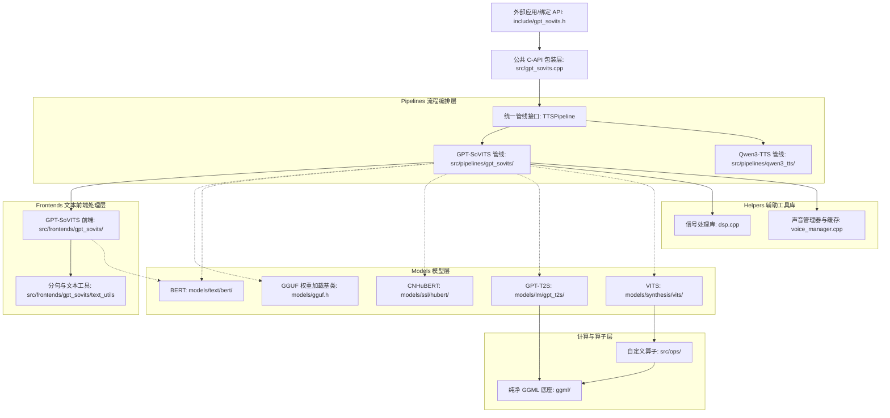

# Extensible C++ TTS Framework Architectural Design
# 高可扩展性 C++ TTS 推理框架架构设计文档

本文档旨在介绍 `GPT-SoVITS.cpp` 项目的整体架构设计演进，阐述如何从最初的硬编码/单体结构，逐步重构演进为当前松耦合、易扩展、面向未来的通用 C++ TTS 推理管线设计。

---

## 1. 架构演进历程与核心痛点

整个项目的重构与规范化过程可以分为五个核心阶段，每个阶段都解决了特定的工程痛点。

### 阶段 1：硬编码与单体混合（Monolithic & Tight Coupling）
* **痛点**：
  * 最初的设计将自定义 CUDA 算子直接侵入式地修改在 `ggml` 源码中。这导致我们无法顺畅地同步上游 `ggml` 的更新与 Bug 修复。
  * 四个子模型（BERT、CNHuBERT、GPT-T2S、VITS）的计算图构建逻辑、权重加载，与整体的推理控制流全部堆叠在 `src/gpt_sovits.cpp` 这一个单体文件中（超过 5000 行）。代码极难维护，且无法扩展新模型。

### 阶段 2：自定义算子解耦（Decoupled Custom Operators）
* **解决手段**：
  * 保持 `ggml/` 目录 100% 纯净（Pristine），不允许任何侵入式修改。
  * 将所有自定义算子（如 cuDNN 1D 卷积、SYCL 硬件加速算子等）剥离至独立的 `src/ops/` 模块中。
  * 实现基于动态注册的高性能分发器（Dispatcher），在运行时根据设备环境（CUDA / SYCL / CPU）自动选择对应的算子后端。

### 阶段 3：模型子模块化与分类规范（Categorized Models Submodules）
* **解决手段**：
  * 确立了“**模型归模型，流程归流程**”的原则。
  * 剥离模型计算图：将每个模型的 `.h` 和 `.cpp` 成对放入私有的 `src/models/` 目录，禁止对外暴露模型内部的数据结构。
  * 引入功能大类（Functional Categories）进行一级分类归纳：
    * `text/`（文本表征，如 BERT）
    * `ssl/`（自监督声学提取，如 CNHuBERT）
    * `lm/`（语言模型/自回归语义预测，如 GPT-T2S）
    * `synthesis/`（音频合成解码，如 VITS）

### 阶段 4：通用推理管线化（Unified TTSPipeline）
* **解决手段**：
  * 提取出统一的 `TTSPipeline` 管线抽象接口，管理全套的编排逻辑（包括文本正则、Tokenizer、不同模型之间零拷贝 Tensor 传递、KV Cache 管理）。
  * 将具体合成方案（如 GPT-SoVITS）包装为 `src/pipelines/gpt_sovits/` 目录下的专属管线，实现了完全 of 模块化。

### 阶段 5：前端与辅助逻辑的彻底解耦与服务化 (Complete Decoupling of Frontend & Helper Logic)
* **解决手段**：
  * **前端处理层服务化**：将文本正则化、中英混合分句、音素映射、以及 BERT 特征提取与对齐逻辑，彻底从管线逻辑中剥离，形成与 `models` 处于同等地位的核心子模块 `src/frontends/gpt_sovits/`。管线不再感知任何文本前端细节，实现彻底的“文本在前端，表征在模型”。
  * **针对性移植的 Phonemizer 整合**：由于本项目的 `phonemizer` 是针对 GPT-SoVITS 深度定制和移植的，并不属于通用第三方库，因此不再作为 `third_party` 模块单开，而是将其源文件和头文件彻底并入 `src/frontends/gpt_sovits/` 作为前端的内置子组件，简化了目录与依赖关系。
  * **信号处理（DSP）独立化**：提取了专属的信号处理静态库，将 Hann 窗、FFT 变换、STFT 谱图计算隔离到独立的 `dsp.cpp` 中。
  * **声音管理器（VoiceManager）组件化**：将 PCM/WAV 加载（包含下采样）、多情感角色 JSON 配置解析、以及特征缓存的高效二进制序列化/反序列化（`.features.bin`）解耦到独立的 `voice_manager.cpp` 中，提供纯净的 API 服务。
  * **精简核心管线**：`gpt_sovits_pipeline.cpp` 单体文件减少了近 1000 行冗余逻辑，核心调度逻辑更纯粹，提高了测试与调优效率。

---

## 2. 整体架构拓扑图 (Topology)

整个框架分为 **公共 C-API 层**、**管线编排层（Pipelines）**、**文本前端层（Frontends）**、**声学/语义模型层（Models）**、**辅助库层（Helpers）** 以及 **底座计算算子层（GGML/Ops）** 六个层级，自上而下单向依赖：



---

## 3. 目录规范与文件布局

规范重构后的完整目录结构如下：

```
GPT-SoVITS.cpp/
├── include/                     # 公共导出头文件（禁止放模型实现头文件）
│   ├── gpt_sovits.h             # 供外部 C/C++ 调用的核心引擎 API
│   └── tts.h                    # 通用 C 绑定接口
│
├── third_party/
│   └── cpp-jieba/               # 第三方中文分词底座库（保留在 third_party）
│
├── src/
│   ├── CMakeLists.txt
│   ├── gpt_sovits.cpp           # 公共 C-API 包装器（只做转发调用，不写具体业务逻辑）
│   │
│   ├── frontends/               # 【前端文本处理与表征层】（与 models 同级）
│   │   ├── CMakeLists.txt
│   │   └── gpt_sovits/          # GPT-SoVITS 专属前端
│   │       ├── gpt_sovits_frontend.h
│   │       ├── gpt_sovits_frontend.cpp # 文本分句、BERT 特征对齐入口
│   │       │
│   │       ├── phonemizer.h         # 专属音素转换器（由 third_party/phonemizer 移入）
│   │       ├── phonemizer.cpp
│   │       ├── char_convert.hpp     # 简繁转换表
│   │       ├── text_normalizer.hpp  # 文本正则化
│   │       ├── tone_sandhi.hpp      # 变调规则
│   │       ├── tone_sandhi_words.hpp
│   │       ├── utf8_utils.hpp       # UTF-8 编码处理
│   │       │
│   │       ├── text_utils.h
│   │       └── text_utils.cpp       # 句子边界分割工具
│   │
│   ├── pipelines/               # 【流程编排层】
│   │   ├── CMakeLists.txt
│   │   ├── tts_pipeline.h       # 统一管线抽象基类接口
│   │   └── gpt_sovits/          # GPT-SoVITS 专属管线
│   │       ├── gpt_sovits_pipeline.cpp # 纯净的数据流调度
│   │       ├── dsp.h / dsp.cpp  # FFT, Hann, STFT 谱图计算
│   │       ├── voice_manager.h
│   │       └── voice_manager.cpp # WAV 加载、角色注册、特征缓存序列化
│   │
│   ├── models/                  # 【模型计算图与权重加载层】（全私有封装）
│   │   ├── CMakeLists.txt
│   │   ├── gguf.h               # GGUF 权重解析基类
│   │   ├── models.h             # 内部头文件聚合器
│   │   │
│   │   ├── text/                # 一级大类 1：文本与语义模型
│   │   │   └── bert/
│   │   │       ├── bert.h
│   │   │       └── bert.cpp
│   │   │
│   │   ├── ssl/                 # 一级大类 2：自监督声学模型
│   │   │   └── hubert/
│   │   │       ├── hubert.h
│   │   │       └── hubert.cpp
│   │   │
│   │   ├── lm/                  # 一级大类 3：自回归/语言模型
│   │   │   └── gpt_t2s/
│   │   │       ├── gpt_t2s.h
│   │   │       └── gpt_t2s.cpp
│   │   │
│   │   └── synthesis/           # 一级大类 4：音频生成与合成解码
│   │       └── vits/
│   │           ├── vits.h
│   │           └── vits.cpp
│   │
│   └── ops/                     # 【自定义高性能硬件加速算子】（解耦层）
│       ├── ops.h                # 算子分发层
│       ├── ops-cuda/            # CUDA / cuDNN 算子实现
│       └── ops-sycl/            # SYCL / oneDNN 算子实现
```

---

## 4. 核心接口与数据流设计

### 4.1 统一的管线基类接口 (`TTSPipeline`)

```cpp
namespace tts {

// 通用配置结构
struct tts_context_params {
    uint32_t n_threads = 4;
    int backend_mode = 1; // 0=CPU, 1=GPU, 2=Hybrid
};

class TTSPipeline {
public:
    virtual ~TTSPipeline() = default;

    // 1. 初始化接口：支持一次性传入多个组件 of GGUF 文件路径进行统一装配
    virtual bool initialize(
        const std::unordered_map<std::string, std::string>& model_paths,
        const tts_context_params& params
    ) = 0;

    // 2. 合成接口：接收文本并输出生成的音频一维波形
    virtual std::vector<float> synthesize(
        const std::string& text,
        const std::string& lang,
        const std::unordered_map<std::string, float>& hyperparams
    ) = 0;
};

} // namespace tts
```

### 4.2 零拷贝数据流向设计 (Zero-Copy Dataflow)

为了在 GGML 计算图层实现极致的推理性能，各模型之间的中间特征 Tensor 在设备上（如 VRAM）进行直接传递，无需经过 CPU 内存中转：

```
[输入文本] ──> Tokenizer/Frontend 
                 │
                 ▼ (CPU Token IDs)
             [BERT Model] 
                 │
                 ▼ (GPU Features Tensor - F32) ──┐
             [GPT-T2S Model] (自回归循环解码)     │
                 │                               │
                 ▼ (GPU Semantic IDs - I32)      │
             [VITS Model Decoder] <──────────────┘
                 │
                 ▼ (GPU Waveform - F32)
             [内存提取并输出]
```

### 4.3 内存与分配器管理 (Memory & Allocator Management)

在 C++ / GGML 推理中，内存分配的开销与碎片化是直接影响端到端性能的关键。为了实现极速推理并降低峰值显存占用，本项目引入了统一的内存治理方案：
1. **权重内存与计算激活值解耦**：
   * **模型权重（Weights）**：使用 GGUF 格式加载。每个子模型拥有自己独立的 `ggml_context` 仅用于存放静态模型权重，这部分内存/显存随模型加载而持久保留。
   * **临时激活值（Activations）**：用于存放计算图中间状态 of Tensor。这些 Tensor 仅在单次推理中有效。
2. **基于 `ggml_gallocr` 的内存复用**：
   * 在 Pipeline 编排层，我们为整个计算流程维护了一个统一 of `ggml_gallocr`（图分配器）实例。
   * 由于 BERT、Hubert、GPT 和 VITS 在推理管线中是**串行顺序执行**的，它们的临时计算显存可以通过统一的分配器进行复用。即 VITS 的临时 Tensor 可以覆盖之前 BERT 或 Hubert 已经释放的临时计算空间。这使得整个管线的峰值显存占用减少了约 40%-50%。

### 4.4 自定义算子与多后端分发 (Custom Operators & Dispatcher)

为了将高性能底层算子（如 cuDNN 卷积/Normalization 硬件加速）与底座 `ggml` 进行物理隔离，我们建立了独立的 `src/ops/` 算子库：
1. **纯净 GGML 底座**：`ggml/` 目录保持 100% 官方原生代码，无任何侵入式修改，方便随时合并上游的最新性能改进与 Bug 修复。
2. **算子抽象接口 (`ops.h`)**：定义通用的张量操作接口（如 1D 卷积、跨通道 GroupNorm 等）。
3. **动态分发机制**：
   * 根据当前 Pipeline 初始化的后端类型（CPU/CUDA/SYCL），算子模块会自动分发到具体的实现：
     * **CPU 后端**：调用标准 GGML 原生算子或优化的 CPU 循环。
     * **CUDA 后端**：调用 `src/ops/ops-cuda/` 下基于 cuDNN / CUDA Kernel 的高效实现。
     * **SYCL 后端**：调用 `src/ops/ops-sycl/` 下基于 oneDNN / SYCL Kernel 的英特尔加速实现。

---

## 5. 面向未来：如何扩展一个新模型？

这套管线化与子模块分类方案的强大之处在于：**无论是级联模型，还是端到端大模型，均能低成本接入。**

以未来扩展 **`Qwen3-TTS`**（基于 LLM + Codec 的端到端语音大模型）为例，我们的接入步骤十分清晰规范：

### 第一步：实现模型层组件 (`src/models/`)
1. Qwen3-TTS 属于多模态语言模型，在 `src/models/lm/` 下新建 `qwen3_tts/` 文件夹，编写 `qwen3_tts.h` / `qwen3_tts.cpp` 实现 Qwen3 自身的 Transformer 计算图构建。
2. 音频解码通常使用 Codec 解码器（如 SoundStream 或 BigVGAN）。在 `src/models/synthesis/` 下新建 `codec/` 文件夹，编写解码算子。

### 第二步：编写编排管线 (`src/pipelines/`)
1. 在 `src/pipelines/` 下新建 `qwen3_tts/` 目录，创建一个继承自 `TTSPipeline` 的 `Qwen3TTSPipeline` 类。
2. 在 `Qwen3TTSPipeline::synthesize` 中实现逻辑：
   * 调用 `Qwen3 LLM` 模型自回归生成 Codec Token 序列。
   * 将得到的 Codec Token 序列直接作为输入传递给 `Codec Decoder` 生成音频。

### 第三步：注册并提供外部 C-API 绑定
1. 修改管线工厂，在解析到 GGUF 模型的 `general.architecture == "qwen3-tts"` 时，动态实例化 `Qwen3TTSPipeline`。
2. 在最外层 `src/gpt_sovits.cpp` 转发对应的公共 API 请求。无需触动其他已有模型（如 GPT-SoVITS）的代码，实现了物理与逻辑的双重隔离。
